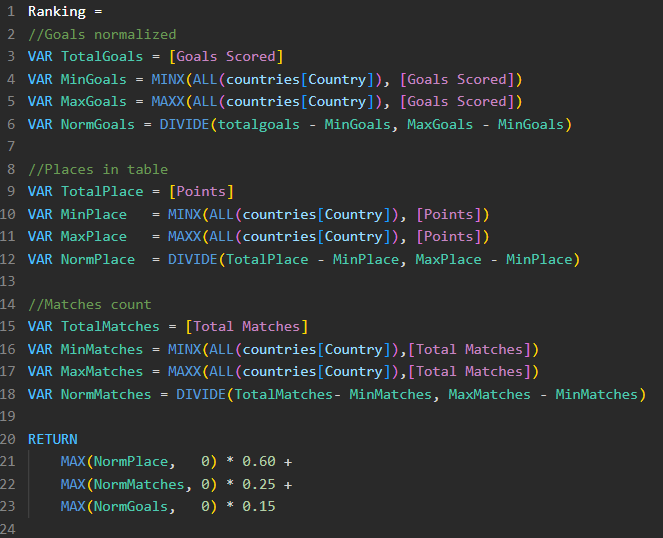
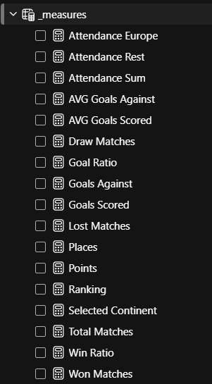
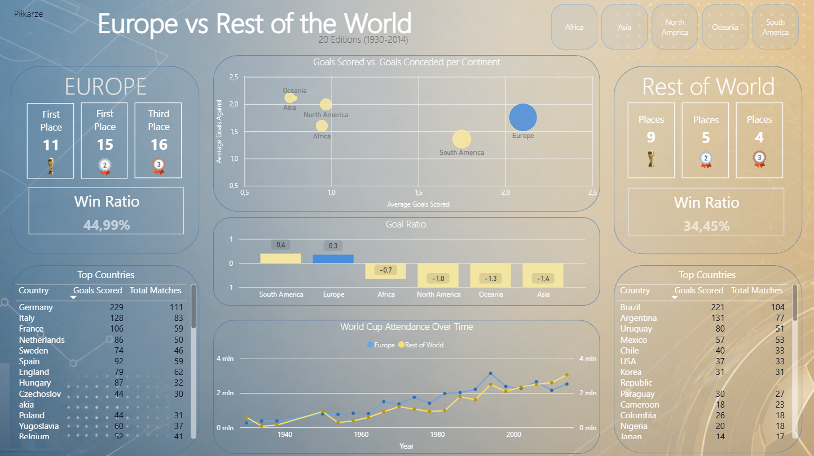

#  World Cups Europe vs Rest of World
https://app.powerbi.com/groups/me/reports/497114ed-aaae-4bb4-84bd-248271ba3e7d/b083ed2ff210d77af757?experience=power-bi

##  Data Source
[FIFA World Cup Dataset – Kaggle](https://www.kaggle.com/datasets/abecklas/fifa-world-cup)

---

## Data Cleaning Log
- Fixed date column converted from invalid format to proper DateTime
-  Renamed group values from numeric (1, 2, 3) to alphabetic (A, B, C) 
     to keep data consistent across all records
- Added `cards` column which decoded event codes (G/R/Y/RSY) 
     into card categories (Yellow Card/Red Card)
- Added `goals` column which calculated by a custom algorithm that counts 
     occurrences of "G" in the Event column using Power Query
-  Found and removed duplicate match records
- Many other required edits

## Data Modeling
- Created table world_cup_match_team with match results, location (Home/Away) and Country for better filtering and connection with countries table
- Created the countries table with all countries and their continents for filtering in analysis
- Divided world_cups table into 2 tables. Table with places and table with info about world cup
- Created a data_table to sort results by date

## Measures
- Created many measures which help compare different data from continents and countries
- Created a normalized ranking of all countries, which 
calculates final places, won matches and scored goals 
with weights distributed 60% / 25% / 15%.

| | |
|---|---|
|  |  |
| | |

# Dashboard Main Page

## Tools
`Power BI` `DAX` `Power Query` `Excel`
